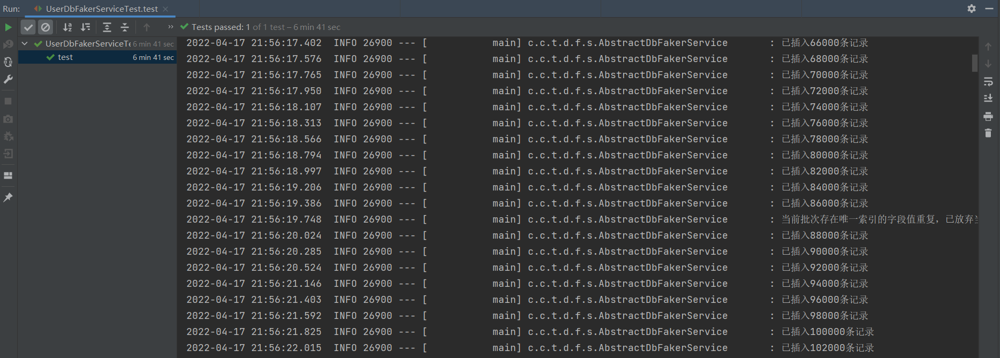
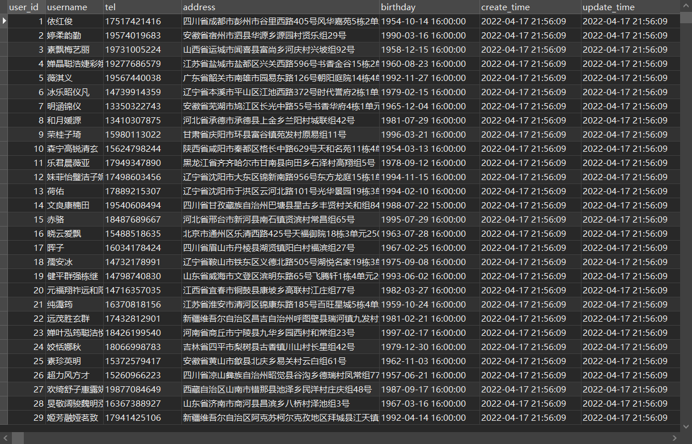

# template-db-faker
一个向db中插入假数据的模板，基于 springboot + mybatis 构建。

pom.xml 中引入的数据库驱动是 mysql 8.x，可根据需要调整。

随机数据生成组件：使用的是国人开源的 [common-random](https://github.com/yindz/common-random)

## 效果




## 使用示例
我提供了2个示例：t_user、t_student，可按照以下步骤使用

1、在数据库中执行 resources/sql脚本/DDL.sql 中的建表语句

2、修改 yml 中的数据源配置

3、执行 com.chy.template.db.faker.service 下对应的单元测试，往db中插入假数据

## 向自定义的数据表中插入假数据
1、创建数据表，并在entity包下创建对应的实体类

2、在mapper包下创建对应的mapper接口，并在 resources/mapper 下编写对应的xml映射文件
```java
//继承DbFakerMapper，泛型指定对应的实体类，无需定义方法
public interface UserMapper extends DbFakerMapper<User> {

}
```

```xml
<!-- 需要实现 DbFakerMapper 中的2个方法：①批量插入，②清空表 -->

<?xml version="1.0" encoding="UTF-8" ?>
<!DOCTYPE mapper
        PUBLIC "-//mybatis.org//DTD Mapper 3.0//EN"
        "http://mybatis.org/dtd/mybatis-3-mapper.dtd">

<mapper namespace="com.chy.template.db.faker.mapper.UserMapper">

    <insert id="batchInsert">
        insert into t_user (`username`, `tel`, `address`, `birthday`) values
        <foreach collection="list" item="user" separator=",">
            (#{user.username}, #{user.tel}, #{user.address}, #{user.birthday})
        </foreach>
    </insert>

    <delete id="truncateTable">
        truncate table t_user
    </delete>

</mapper>
```

3、根据需要修改yml中的配置

4、在 service.impl 包下编写对应的service
```java
/**
 * 继承 AbstractDbFakerService，泛型指定对应的实体类
 * 实现 getMapper()、generateFaker() 2个方法，根据需要选择重写 getCountOfEachBatch() 方法
 */
@Slf4j
@Service
public class UserDbFakerService extends AbstractDbFakerService<User> {

    @Resource
    private UserMapper userMapper;

    @Override
    protected DbFakerMapper getMapper() {
        return userMapper;
    }

/*
    @Override
    public int getCountOfEachBatch(){
        return 1000;
    }
*/

    @Override
    public User generateFaker() {
        //随机中文用户名，最大长度8个汉字
        String username = PersonInfoSource.getInstance().randomChineseNickName(8);
        String tel = PersonInfoSource.getInstance().randomChineseMobile();
        String address = AreaSource.getInstance().randomAddress();

        //生日，1950~2000的随机时间
        LocalDate beginDate = LocalDate.of(1950, 1, 1);
        LocalDate endDate = LocalDate.of(2000, 1, 1);
        String randomDateStr = DateTimeSource.getInstance().randomDate(beginDate, endDate, "yyyy-MM-dd");
        //允许此字段为null
        Date birthday = null;
        try {
            birthday = DateFormat.getDateInstance().parse(randomDateStr);
        } catch (ParseException e) {
            log.error("String类型的时间转换为Date对象出错，randomDateStr={}", randomDateStr, e);
        }

        return User.builder()
                .username(username)
                .tel(tel)
                .address(address)
                .birthday(birthday)
                .createTime(new Date())
                .build();
    }

}
```

5、编写对应的单元测试，往db插入假数据
```java
@SpringBootTest
@RunWith(SpringRunner.class)
public class UserDbFakerServiceTest {

    @Resource
    private UserDbFakerService userDbFakerService;

    @Test
    public void test() {
        //清空已有数据
        userDbFakerService.cleanAllFaker();
        //插入新数据
        userDbFakerService.batchInsertFaker(1000000);
    }

}
```

## 说明
- 每批次插入时，如果存在唯一索引列值重复的情况，会直接抛弃该批次的数据。如果插入的数量总量比较大，达到数百万、数千万，可以将每批次插入的数据量调小些，以降低唯一索引列值重复的几率、提高插入成功率。
- 单元测试中，可根据需要选择是否先清空表数据再插入。
